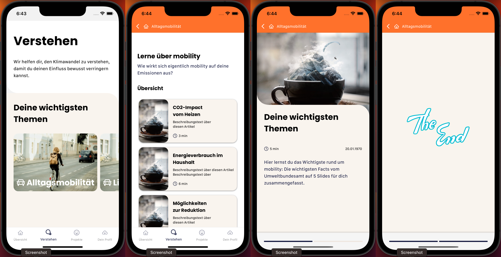
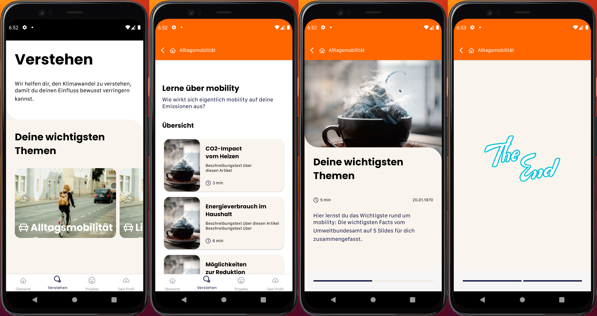

# CliMONY challenge

## OVERVIEW of the achieved Screens

    
    

## Main technologies used

- React Native
- expo
- Typescript
- react-query
- React Navigation

## Main functionality

#### 2.1 **"Verstehen Overview (1)" Screen:**

- The screen consists of two content sections:
  - Section 1: a static title and description (please get it from Figma)
  - Section 2: contains a card row
    - The card row need to be horizontally scrollable: The user can swipe left to scroll right and swipe right to scroll left.
    - Every card contains an image, a title and an icon.
    - The user can press on the first card. The other cards should be disabled. Via pressing on the card, the user gets to a new screen, the category overview screen.
- The screen contains a bottom navigation. Only "Verstehen" tab should be enabled and touchable.

#### 2.2 **"Category Overview (2)" Screen:**

- The screen contains a top bar that is colored in the category highlight color (see Figma) and contains an icon, a category title and a back button. By pressing on the back button, the user gets to the Overview Screen (1).
- The screen contains a category title and description.
- The screen contains cards a scrollable list (top to down) that allows to scroll.
- Every card contains an image (please use a placeholder image if no image is given), a title, a short description and a reading time indication.
- The user can press on the first card. Via pressing on the card the user gets to a new screen: The Detail Screen (3). The other cards touch functionality should be disabled.
- The screen contains a bottom navigation.

#### 2.3 **"Article Slides (1)" Screen:**

- Both screens contain a top bar that is colored in the category highlight color and contains an icon, category title and a back button. By pressing on the back button, the user gets to the "Category Overview (2)" Screen.
- Both screens contain a pagination indication that adjusts automatically.
- The "Article Slides (1)" screen contains an image (please use a placeholder image if API is not responding it), a title, a reading time indication, a date and a description.

- Both screens are swipeable:
  - If the user swipes to the left, he will get to the "Article Slides (2)" screen, that shows a view with an "The End" image.
  - If the user swipes back to the right, he will get back to the "Article Slides (1)" screen.
  - The pagination component needs to adjust automatically.

## Prerequisites

- Expo CLI to be installed. You can install it by running the command:

- Simulator or emulator to run the app on.

### Installation

First clone the repo using `SSH` or `HTTPS`.
Here's an example using `HTTPS`:

`git clone https://github.com/MMelek00/climony.git`

Second run the following command to install project dependencies:

`yarn install` or `npm install`

- navigate to `/server` directory and run

1. `npm install`
2. `node index`

**IMPORTANT NOTE**

- navigate to `src/api/ApiConstants.ts` and change the const `LOCALHOST` field to your local inet (you can check it by typing in terminal `ifconfig` on windows or `ip addr | grep inet` on Macbook )

**Run the Project**

- run `npm run android` or `npm run ios` to run emulator or simulator.

- run `npm start` then scan the QRCode with you real device
